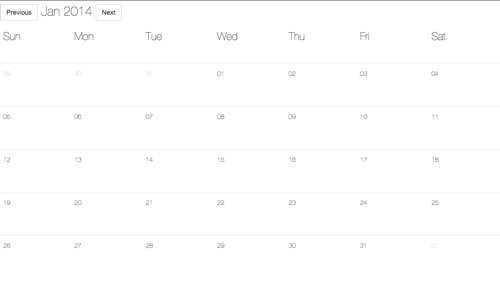

# Angular 101
An introduction to AngularJS 

by [@_joseraya](http://www.twitter.com/_joseraya) and [@manel_perez](http://www.twitter.com/manel_perez)

---
## Why Angular?

Easier to develop

Easier to reuse

Easier to mantain

<small> These are our reasons, YMMV </small>
--
## Easier to develop

Data Binding greatly reduces the need to manipulate the DOM

Much less code to write :)

Separation of concerns helps to focus
--
## Easier to reuse

Separation of concerns makes reuse easier too

Directives make reuse of 'html' components easier
--
## Easier to mantain

Dependency injection makes testing easier

Did we say there is less code to write? There is also less code to mantain
--
All in a single, coherent, complete package 

(AngularJS is a one-stop framework)
---
## The workshop

We are going to incrementally build a calendar application

Sorry but there will be no tests (we want to keep it simple)
--
## Tools

We need `grunt-cli` and `npm` to "build" the application

`livereload` is recommended

and, of course, an editor and a browser 
---
## STEP 0

Set it up

	git clone git@github.com:agilogy/angular-101.git
	cd angular-101
	git checkout step_0
    npm install
    grunt

Point your browser to `http://localhost:3000/`

<small>If you are on windows, you will need to also run bower install</small>
---
## STEP 1: Templates and controllers

This is a template:

	

    	

	        <h1>
	            Today is {{today | date:'mediumDate'}}
	        </h1>
	    

    

`ng-controller` is a **directive**

`{{today | date:'mediumDate'}}` is an **expression** where

`date` is a **filter**
--
	And this is a controller:

    var calendar = angular.module('calendar', []);
    calendar.controller('CalendarController', function ($scope) {
        $scope.today = new Date();
    });

$scope is the variable that binds together the controller and the template 

--

### Let's code:

Add two buttons to go to previous and next date

	<button class="btn btn-default btn-lg" ng-click="prev()"> Previous </button>
---
## STEP 2: More templates and data binding

ng-repeat
--

ng-repeat directive

    <td ng-repeat="label in ['Sun','Mon','Tue','Wed','Thu', 'Fri', 'Sat']">
        {{label}}
    </td>

or

    <td ng-repeat="label in labels">
        {{label}}
    </td>
--
### Let's code:

Show a whole month, like here: 

previous and next move across months, not days

---
## STEP 3: Services and dependency injection
dependency injection

services, values and factories
--
###Dependency injection
Our components are not responsible for the resolution of their dependencies. 

Makes testing easier

Better separation of concerns: Dependency resolution is not a concern for our code anymore

    calendar.controller('CalendarController', 
    	function ($scope, $modal, CalendarService) {
    	... this controller depends on $scope, $modal and CalendarService
    });
--
Dependency injection at the module level determines the loading of the module (if no one depends
on module X it will not be loaded)

Dependency injection at the service/controller level determines what is available to the service/controller

--
##Services, values and factories

A service can be either an object or a function that provides some behavior to other components

We can register it by using the Module#factory method:

	var myModule = angular.module('myModule', []);
    myModule.factory('CalendarService', function($http) {
    	... the calendar service depends on the $http service
    	});

--
### Let's code:

Refactor your application so that your controller has only presentation logic and domain logic is moved to a service

---

## Other topics to explore with this repo
--
###Angular promises

Angular's $q is a promise implementation inspired by `Q`

	var promise = asyncGreet('Robin Hood');
	promise.then(function(greeting) {
	  alert('Success: ' + greeting);
	}, function(reason) {
	  alert('Failed: ' + reason);
	}, function(update) {
	  alert('Got notification: ' + update);
	});

Promises are a way to avoid callback hell and are easy to compose

--
### Angular UI
A collection of UI-related modules

ui-bootstrap implements bootstrap without depending on jquery

We have used it for the modal component (edit / delete an event)

It provides a promise based API 
--
### Angular HTTP

This service facilitates communication with remote HTTP servers

It provides an API similar to the one of the promises

    $http.get('/someUrl').success(successCallback);

Alternatively, you can also use the `resource` service

Angular also provides a way to mock the server for testing
--
### Let's code

* Edit an event (using AngularUI's modal)
* Delete an event
* Use $http to communicate with a backend (you can use MongoHQ REST API)
---
#Thank you!

